# Interfaces Inteligentes
## Lab 3 - Físicas

### Situación inicial

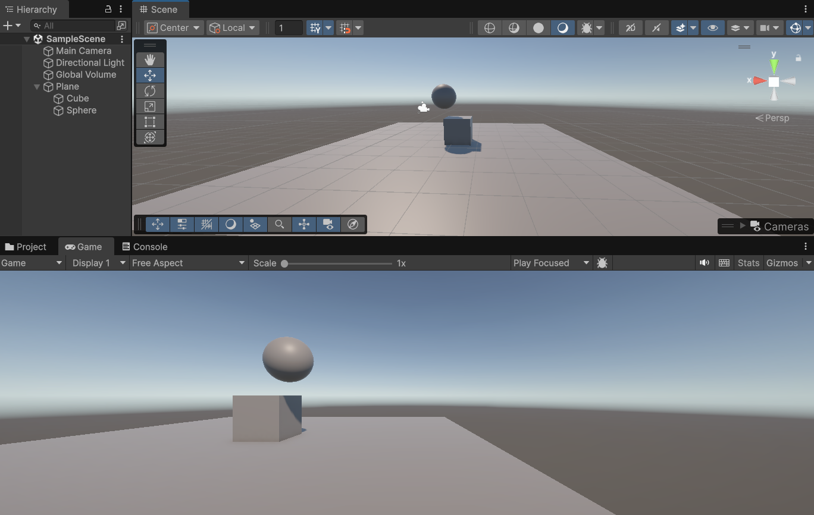

### Ejercicios Físicas 3D

**Situación 1:**

El plano no es un objeto físico. El cubo es un objeto físico y la esfera no. En este caso, el plano y la esfera sólo tendrán collider, mientras que el cubo debe tener Rigidbody.

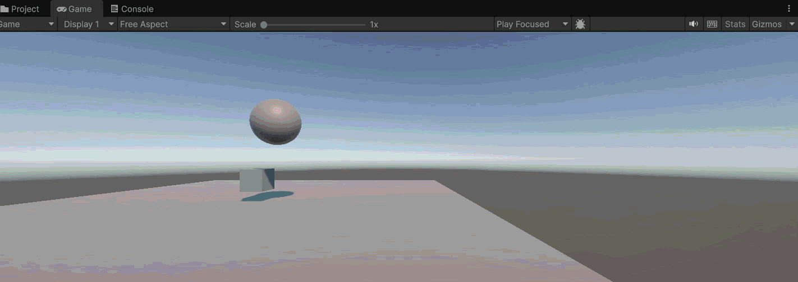

Cambiamos el tamaño del cubo para que se visualicen mejor las físicas, pues con tamaño 1 se quedaba donde estaba. Con escala 0.5, se ve con suficiente distancia al plano, y al agregarle un RigidBody cae cuando le damos al play.

**Situación 2:** 

El plano no es un objeto físico. El cubo es un objeto físico y la esfera también. En este caso, el plano sólo tendrán collider, mientras que el cubo y la esfera deben tener Rigidbody.

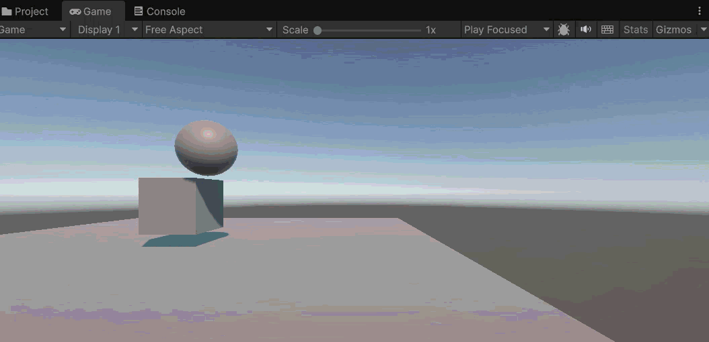

En esta ocasión, dejamos el cubo con escala 1, pero cambiamos la y a 0.75, de forma que vemos el choque con la esfera y con el plano al caer. Como tanto la esfera como el cubo tienen RigidBody, ambos se ven afectados por la gravedad y caen, pero al tener un plano que no es un objeto físico, ambos chocan con el mismo. En el caso de la esfera, sigue rodando encima del plano hasta caer por un lateral. 

**Situación 3:**

El plano no es un objeto físico. El cubo es un objeto físico y la esfera es cinemática. En este caso, el plano sólo tendrán collider, mientras que el cubo y la esfera deben tener Rigidbody esta última cinemático.

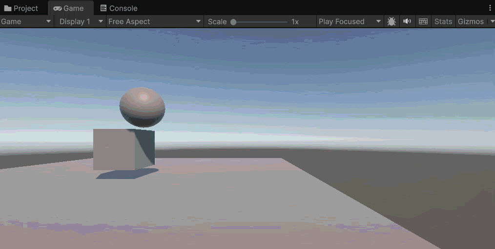

En este caso, como la esfera es cinemática, aunque tenga RigidBody, no le afecta la gravedad, y s emovería solo con un script o algo por el estilo agregado. Mientras, el cubo sigue cayendo.

**Situación 4:**

El plano es un objeto físico. El cubo es un objeto físico y la esfera es física. En este caso, todos los objetos deben tener Rigidbody.

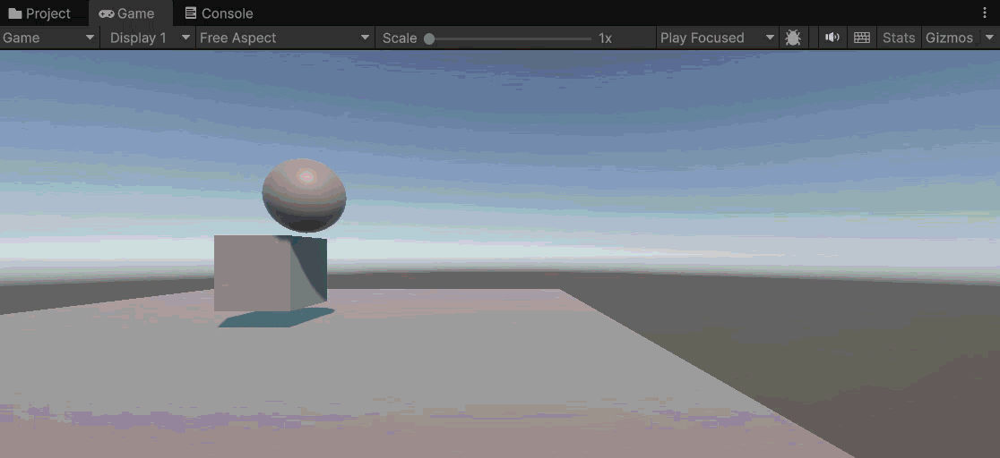

Al poner el plano como objeto físico, si no lo ponemos cinemático, se caerá con el resto de elementos como la esfera y el cubo, pues le afecta la gravedad.

**Situación 5:**

El plano es un objeto físico. El cubo es un objeto físico y la esfera es física con 10 veces más masa que el cubo. En este caso, todos los objetos deben tener Rigidbody.

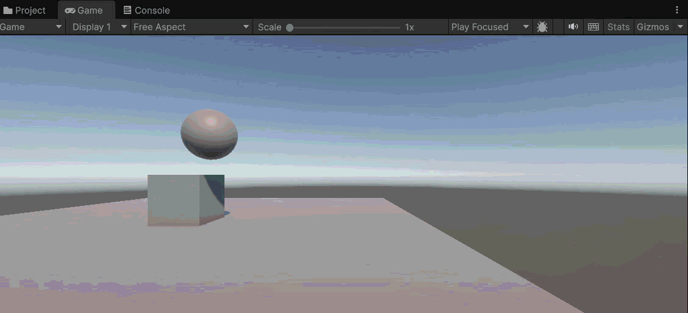

A partir de este momento, para ser capaces de ver los cambios reales que estamos realizando, ponemos el plano como objeto físico pero cinemático, de esta forma no se ve afectado por la gravedad y tanto el cubo como la esfera pueden colisionar con él. Para este caso concreto, volvemos a colocar el cubo en posición y = 0.5, de esta forma vemos una diferencia clara en lo que hace aumentar la masa a la esfera. Los objetos caen a la misma velocidad, no se ve modificada por el cambio en masa, pero sí se ve un aumento de fuerza al chocar (F = m * a), lo que hace que el cubo reaccione más cuando tocan, podría incluso llegar a volcar si el peso fuese mayor.

**Situación 6:**

El plano es un objeto físico. El cubo es un objeto físico y la esfera es física con 100 veces más masa que el cubo. En este caso, todos los objetos deben tener Rigidbody.

Como comentábamos previamente, al aumentar aún más el peso de la esfera podemos comprobar que la fuerza es mucho mayor a la hora de chocar contra el cubo.

**Situación 7:**

El plano es un objeto físico. El cubo es un objeto físico y la esfera es física con fricción. En este caso, todos los objetos deben tener Rigidbody.

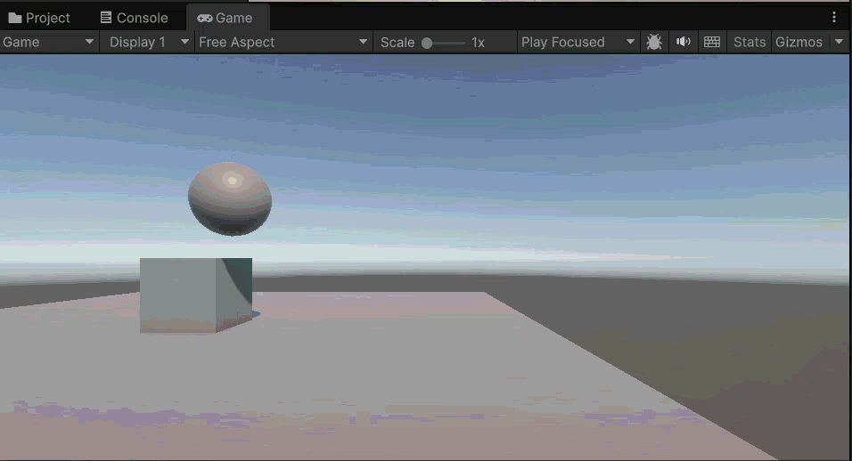

Al aumentar la fricción en la esfera, el resultado esperado es que disminuya la velocidad de la misma al chocar y rodar contra el plano.

**Situación 8:**

El plano es un objeto físico. El cubo es un objeto físico y la esfera no es física y es Trigger. En este caso, todos los objetos deben tener Rigidbody.

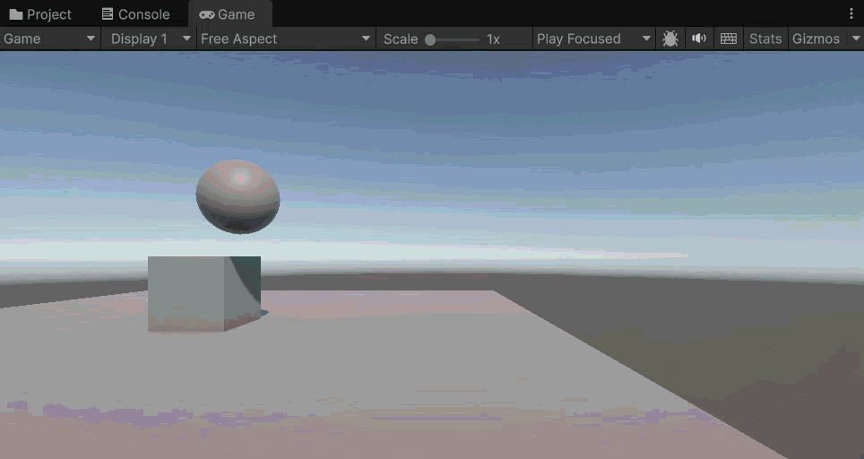

**Situación 9:**

El plano es un objeto físico. El cubo es un objeto físico y la esfera es física y es Trigger. En este caso, todos los objetos deben tener Rigidbody.

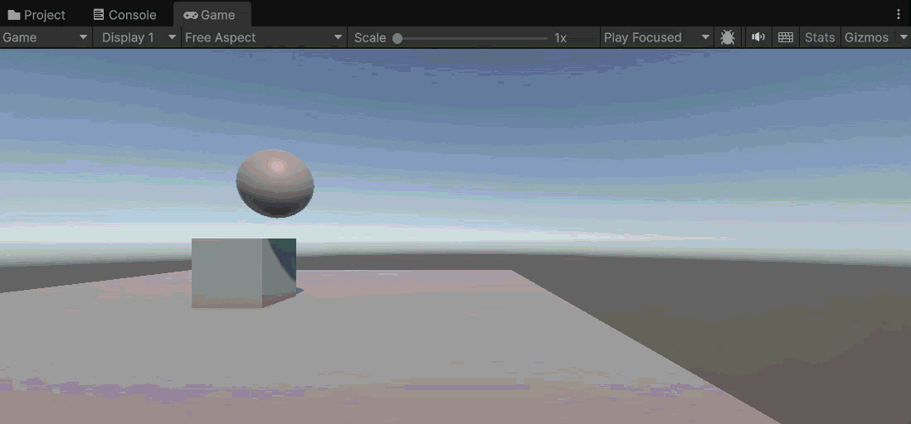

### Ejercicios Físicas 3D - Scripts

**Ejercicio 1:**

Crea un personaje, controla su desplazamiento con las teclas WASD o las flechas, el movimiento debe estar influenciado por usando un Rigidbody, pero manteniendo el control total.

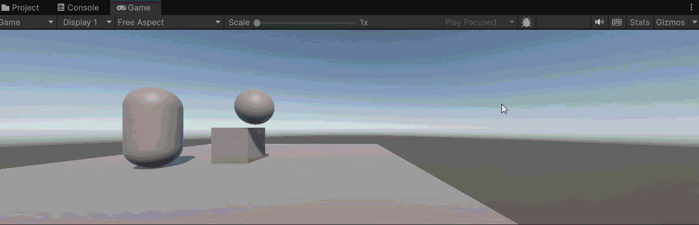

**Ejercicio 2:**

Crea varios cubos o esferas con Rigidbody dinámico. Muestra por consola el nombre del objeto con el que colisiona, y cámbiale su color al colisionar.

**Ejercicio 3:**

Crea una zona (por ejemplo, un cubo grande con Is Trigger = true). Al entrar, cambia el color del personaje o activa un efecto que cambie la luz. Al salir, revierte el cambio. Añade otra zona que aumente una variable daño.

**Ejercicio 4:**

Crea tres tipos de objetos en capas distintas: jugador, enemigos, recolectables. Configura la Layer Collision Matrix (Project Settings > Physics). Haz que los enemigos solo colisionen con el jugador, y que los recolectables solo sean detectados por triggers.

**Ejercicio 5:** 

Crea una escena con distintos materiales físicos (resbaladizo, rugoso, rebote alto). Aplica distintos Physic Materials a objetos. Lanza los objetos con AddForce() al pulsar la tecla X y observa cómo cambian las reacciones.

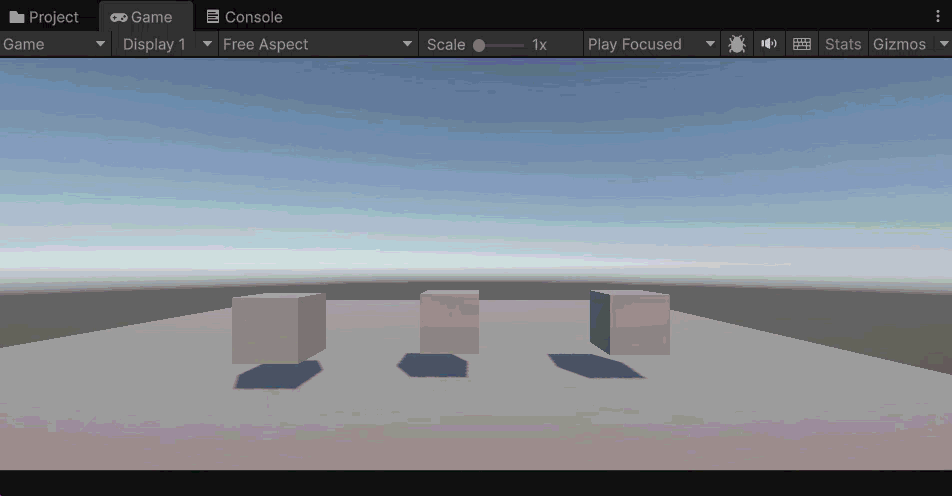
